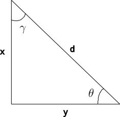

#+TITLE: ES118 Lab #3
#+AUTHOR: Ufuk Baler, MSc. & Assoc. Prof. Dr. Fethi Okyar
#+DATE: 2025-10-13
#+SUBTITLE: Basic calculations, Demo of elementary NumPy functions
#+STARTUP: overview
#+REVEAL_THEME: simple
#+REVEAL_INIT_OPTIONS: slideNumber:"c/t", width:1920, height:1080, navigationMode:"linear", transition:"none"
#+REVEAL_TITLE_SLIDE: <h1>%t</h1> <h2>%s</h2> <h5>%a</h5>
#+OPTIONS: timestamp:nil toc:1 num:nil reveal_global_footer:nil
#+REVEAL_EXTRA_CSS: ../style.css
#+LATEX_HEADER: \usepackage{amsmath}

* Demonstration
** Triangle problem

- Create a file called ~lab3_problem1.py~, and do the following.
- Write a function called ~triangle~ which accepts two arguments ~x~ and ~y~ which are the lengths depicted in the figure above.
- The function shall compute $\theta$, $\gamma$, $d$, and secant of $\theta$. The computed angles must be in degrees.
- The function will return the computed variables.

** The relative error of $\pi$ in computations

Create a file called ~lab3_problem2.py~, and do the following.

Write a function called ~surface_area~. The function computes the surface area of Earth using the formula,

$$S_{obl} = 2\pi a^2 \Bigg( 1 + \frac{1-e^2}{e} \text{arctanh} (e) \Bigg)$$

where $a$ is the length of the semi-major axis that is 6378.137 km.

The function takes the approximate value of $\pi$ as the argument.

Write another function called ~compute_error~, which takes two approximate values of $\pi$. It shall compute and return the error
$$\text{Error} = \frac{|S_{obl,1} - S_{obl,2}|}{S_{obl,2}}\times 100 \%$$

* Deliverables
1. Github Classroom assignment
2. quiz-lab-3 on Yulearn
