#+TITLE: ES118 Lecture #10
#+AUTHOR: Ufuk Baler, MSc. & Assoc. Prof. Dr. Fethi Okyar
#+SUBTITLE: Plotting
#+STARTUP: overview
#+REVEAL_THEME: simple
#+REVEAL_INIT_OPTIONS: slideNumber:"c/t", width:1920, height:1080, navigationMode:"linear", transition:"none"
#+REVEAL_TITLE_SLIDE: <h1>%t</h1> <h2>%s</h2> <h5>%a</h5>
#+OPTIONS: timestamp:nil toc:1 num:nil reveal_global_footer:nil
#+REVEAL_EXTRA_CSS: ../style.css
#+LATEX_HEADER: \usepackage{amsmath}
#+MACRO: color @@html:$2@@

* Motivation
#+REVEAL_HTML: 

#+ATTR_HTML: :width 900px
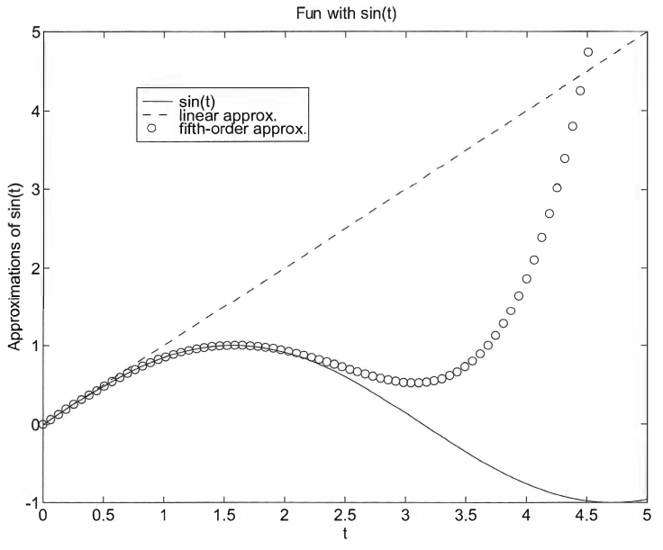
#+REVEAL_HTML: 

#+REVEAL_HTML: 

#+ATTR_HTML: :width 900px
#+ATTR_REVEAL: :frag (appear)
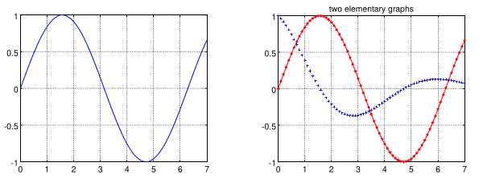
#+REVEAL_HTML: 

* Single 2-D plot
** Preliminaries
- We have to first import necessary libraries
- Matplotlib is used for plotting
- Plotting requires data to be visualized, therefore NumPy is suitable for that purpose
#+BEGIN_SRC python
import matplotlib.pyplot as plt
import numpy as np

# ...
#+END_SRC

** Changing figure size
#+REVEAL_HTML: 

- Sometimes the figure needs to be resized
- Use ~figsize~ argument in ~plt.figure()~

#+REVEAL_HTML: 

#+REVEAL_HTML: 

#+BEGIN_SRC python
import matplotlib.pyplot as plt
import numpy as np

plt.figure(figsize=(12, 8)) # height vs width

# ...
#+END_SRC
#+REVEAL_HTML: 

  
** The ~plot~ function
#+REVEAL_HTML: 

- ~plot~: plots any x and y pairs
#+BEGIN_SRC python
plt.plot(x, y, 'style-option')
#+END_SRC
where
- ~x~: 1-D array
- ~y~: 1-D array
- ~'style-option'~ specifies
  + the color
  + line style
  + the point-marker style
#+REVEAL_HTML: 

#+REVEAL_HTML: 

_Examples_:
- ~plt.plot(x,y)~: plots x versus y with a solid line
- ~plt.plot(x,y,'--')~: plots x versus y with a dashed line
- ~plt.plot(x,y,'r--')~: plots x versus y with a red dashed line
- ~plt.plot(x,y,'r^')~: plots x versus y with red triangles
- ~plt.plot(x,y,'r^-')~: plots x versus y with red triangles on a solid line
#+REVEAL_HTML: 

** Single 2-D plot example
#+REVEAL_HTML: 

#+BEGIN_SRC python
import numpy as np
import matplotlib.pyplot as plt

# generate x data:
t = np.linspace(0,2*np.pi,100)
# generate y data:
f = np.sin(t)
# plot with a solid line:
plt.plot(t, f)
#+END_SRC
#+REVEAL_HTML: 

#+REVEAL_HTML: 

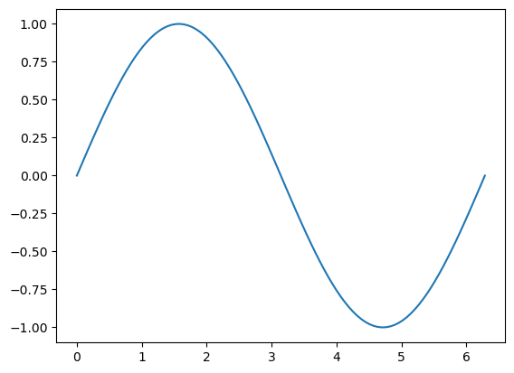
#+REVEAL_HTML: 

** ~'style-option'~
#+REVEAL_HTML: 

| Color       | Line           | Marker          |
|-------------+----------------+-----------------|
| ~y~ yellow  | ~-~ solid      | ~+~ plus sign   |
| ~m~ magenta | ~--~ dashed    | ~o~ circle      |
| ~c~ cyan    | ~:~ dotted     | ~*~ asterisk    |
| ~r~ red     | ~-.~ dash-dot  | ~x~ x-mark      |
| ~g~ green   | ~none~ no line | ~.~ point       |
| ~b~ blue    |                | ~^~ up triangle |
| ~w~ white   |                | ~s~ square      |
| ~k~ black   |                | ~d~ diamond     |
#+REVEAL_HTML: 

#+REVEAL_HTML: 

- ~plt.plot(x,y,'r')~: plots x versus y with a *red solid* line
- ~plt.plot(x,y,':')~: plots x versus y with a *dotted* line
- ~plt.plot(x,y,'b--')~: plots x versus y with a *blue dashed* line
- ~plt.plot(x,y,'+')~: plots x versus y as *unconnected points marked by +*
#+REVEAL_HTML: 

** ~'style-option'~ example
#+REVEAL_HTML: 

#+BEGIN_SRC python
import numpy as np
import matplotlib.pyplot as plt

# generate x data:
t = np.linspace(0,2*np.pi,100)
# generate y data:
f = np.sin(t)
# plot with connected red squares
plt.plot(t, f, "rs-")
#+END_SRC
#+REVEAL_HTML: 

#+REVEAL_HTML: 

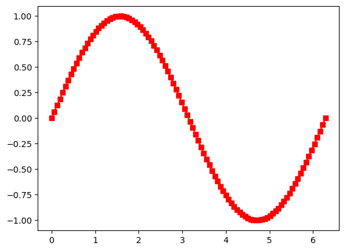
#+REVEAL_HTML: 

** Labels, title, and other text objects
#+REVEAL_HTML: 

- ~plt.xlabel('x (m)')~: labels the x-axis with ~x (m)~
- ~plt.ylabel('p (Pa)')~: labels the y-axis with ~p (Pa)~
- ~plt.title('Pressure Variation')~: titles the plot with ~Pressure Variation~
- ~plt.text(5,-180,'Note this dip')~: annotates ~"Note this dip"~ at the location (5, -180) in the plot coordinates
#+BEGIN_SRC python
import matplotlib.pyplot as plt                        
import numpy as np                                     
                                                       
x = np.linspace(0,2*np.pi,100)
p = np.sin(x)*np.exp(x)

plt.plot(x, p, 'k') # plots
plt.xlabel('x (m)') # creates the label for x-axis
plt.ylabel('p (Pa)') # creates the label for y-axis
plt.title('Pressure Variation') # creates a title
plt.text(5,-180,'Note this dip') # annotates a text
#+END_SRC
#+REVEAL_HTML: 

#+REVEAL_HTML: 

#+ATTR_HTML: :width 700px
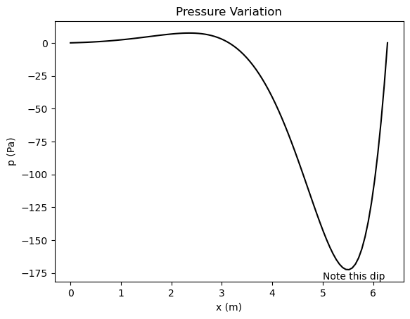
#+REVEAL_HTML: 

** Grid
#+REVEAL_HTML: 

- A grid makes it easier to analyze a plot
- ~plt.grid()~ function draws grid  

#+BEGIN_SRC python
import matplotlib.pyplot as plt                        
import numpy as np                                     
                                                       
x = np.linspace(0,2*np.pi,100)
p = np.sin(x)*np.exp(x)
plt.plot(x, p, 'k')
plt.xlabel('x (m)') # creates the label for x-axis
plt.ylabel('p (Pa)') # creates the label for y-axis
plt.title('Pressure Variation') # creates a title
plt.text(5,-180,'Note this dip') # annotates a text
plt.grid() # adds grid

plt.show()
#+END_SRC
#+REVEAL_HTML: 

#+REVEAL_HTML: 

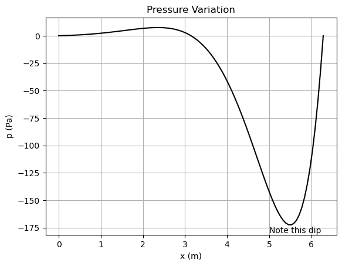
#+REVEAL_HTML: 

* Overlay plots
- We can plot data on top of each other by utilizing the overlay concept.
- After each ~ax.plot~ function execution, a plot is generated on the same figure
#+REVEAL_HTML: 

/Ex./:
#+BEGIN_SRC python
import matplotlib.pyplot as plt
import numpy as np

# Generate data points
x1 = np.linspace(0, 100, 50)
x2 = np.linspace(0, 100, 1000)

f = 20*x1 + 3
g = 3*x1**2 + np.sqrt(x1)
h = 3e3*np.sin(5*x2) * np.exp(-0.5*x2)

# Plot an overlay 2D plot for f, g, h
plt.plot(x1, f, "o", label = "f(x) = 20x + 3")
plt.plot(x1, g, "^-", label = "g(x) = 3x^2 + x^(1/2)")
plt.plot(x2, h, "-", label = "h(x) = 3*10^3*sin(5x) * exp(-0.5x)")
plt.legend()

# Other stuff
plt.title("Plot for f(x), g(x), and h(x)")
plt.xlabel("x")
plt.ylabel("y")
plt.grid()

plt.show()
#+END_SRC
#+REVEAL_HTML: 

#+REVEAL_HTML: 

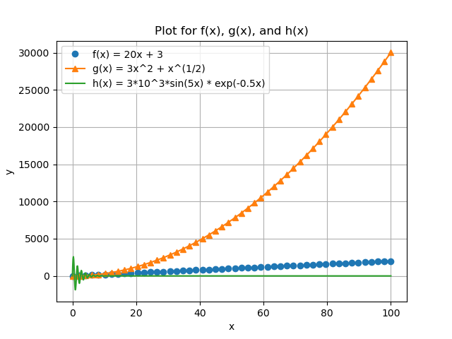
#+REVEAL_HTML: 

* Subplotting
- If there are more than one frames, we can collect those frames into one figure by subplotting.
- All the previous methods can be applied on subplotting
- Only ~plt.subplot~ will be added before each subplot section

** Subplots configured as 1D arrays
#+REVEAL_HTML: 

- Let's create $1\times2$ subplots
#+BEGIN_SRC python
import matplotlib.pyplot as plt                        
import numpy as np                                     
                                                       
# generate data
x = np.linspace(0,2*np.pi,100)
p = np.sin(x)*np.exp(x)
g = np.sin(5*x)/x

# access first subplot
plt.subplot(1,2,1)
# then plot
plt.plot(x, p, 'k')
plt.xlabel('x (m)')
plt.ylabel('p (Pa)')
plt.title('Pressure Variation')
plt.grid()

# access second subplot
plt.subplot(1,2,2)
# then plot
plt.plot(x, g, 'ro-')
plt.xlabel('x')
plt.ylabel('sin(5x)/x')
plt.title('sin(5x)/x vs x')

plt.tight_layout()

plt.show()
#+END_SRC
_Note_:- ~plt.tight_layout()~ adjusts the gaps between the figures such that labels and titles are clearly seen
#+REVEAL_HTML: 

#+REVEAL_HTML: 

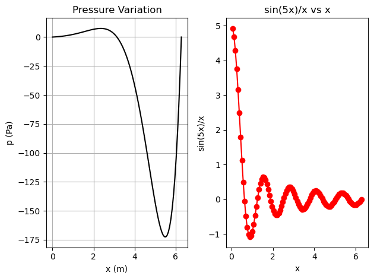
#+REVEAL_HTML: 

** Subplots configured as 2D arrays
#+REVEAL_HTML: 

- Let's create $2\times2$ subplots
#+BEGIN_SRC python
import matplotlib.pyplot as plt
import numpy as np

x = np.linspace(0,2*np.pi,100)
y1 = np.sin(x)
y2 = x
y3 = x - (x**3)/6 + (x**5)/120
y4 = np.sin(x)*np.exp(x)

# plotting the first frame in a 2x2 grid
plt.subplot(2,2,1)
plt.plot(x,y1)
plt.xlabel("x")
plt.ylabel("y1")
plt.title("First subplot")
plt.grid()

# plotting the second frame in a 2x2 grid
plt.subplot(2,2,2)
plt.plot(x,y2)
plt.xlabel("x")
plt.ylabel("y2")
plt.title("Second subplot")
plt.grid()

# plotting the third frame in a 2x2 grid
plt.subplot(2,2,3)
plt.plot(x,y3)
plt.xlabel("x");
plt.ylabel("y3");
plt.title("Third subplot");
plt.grid()

# plotting the fourth frame in a 2x2 grid
plt.subplot(2,2,4)
plt.plot(x,y4)
plt.xlabel("x");
plt.ylabel("y4");
plt.title("Fourth subplot");
plt.grid()

plt.tight_layout()
plt.show()
#+END_SRC
#+REVEAL_HTML: 

#+REVEAL_HTML: 

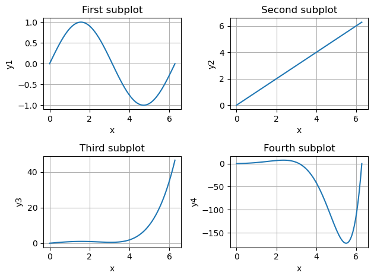
#+REVEAL_HTML: 

* Examples
** Example-1
#+REVEAL_HTML: 

#+BEGIN_SRC python
import matplotlib.pyplot as plt
import numpy as np

x = np.linspace(0,10,100)
t = np.linspace(0,4,50)

f = np.exp(-x) * np.sin(2*np.pi*x)
g = 5*x
h = 1/2 * 9.81 * t**2

plt.plot(x,f,"k")
plt.title("f(x) vs x")
plt.xlabel("x")
plt.ylabel("f(x)")

plt.grid()

plt.show()
#+END_SRC
#+REVEAL_HTML: 

#+REVEAL_HTML: 

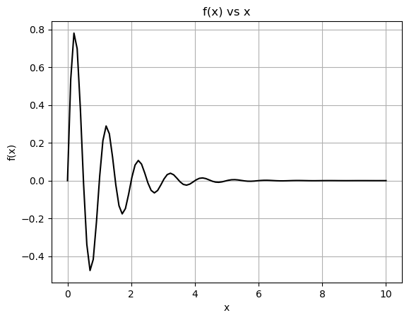
#+REVEAL_HTML: 

** Example-2
#+REVEAL_HTML: 

#+BEGIN_SRC python
import matplotlib.pyplot as plt
import numpy as np

# DATA GENERATION
# x-axis:
x = np.linspace(0,2*np.pi,100)

# f function (discontinuous):
f = np.zeros((100,))

f0 = np.sin(x[(0 <= x) & (x < np.pi/2)])
f[0:np.size(f0)] = f0

f1 = x[(np.pi/2 <= x) & (x < np.pi)]
f[np.size(f0):np.size(f0) + np.size(f1)] = 0

f2 = np.sin(x[(np.pi <= x) & (x < 3*np.pi/2)])
f[np.size(f0) + np.size(f1):np.size(f0) + np.size(f1) + np.size(f2)] = f2

# no need to evaluate the last section because it also remains 0 in f

# other two functions:
g = -x**2 + 3
h = 3*np.ones((np.size(x),))

# PLOTTING
# first subplot:
plt.subplot(1,2,1)
plt.plot(x,f,"ks-")
plt.title("f(x) vs x")
plt.ylabel("f(x)")
plt.xlabel("x")
plt.grid()

# second subplot:
plt.subplot(1,2,2)
plt.plot(x,g,"b-",label="g(x) = -x**2 + 3")
plt.plot(x,h,"r-",label="h(x) = 3")
plt.title("Two functions")
plt.ylabel("outputs")
plt.xlabel("x")
plt.legend()
plt.grid()

plt.tight_layout()

plt.show()
#+END_SRC
#+REVEAL_HTML: 

#+REVEAL_HTML: 

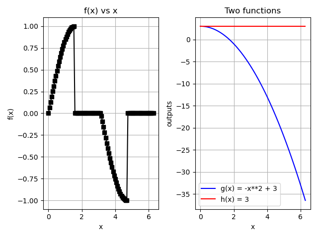
#+REVEAL_HTML: 

