#+TITLE: ES118 Lecture #2
#+AUTHOR: Ufuk Baler, MSc. & Asst. Prof. Dr. Fethi Okyar
#+SUBTITLE: Programming environments: Python, and Git
#+STARTUP: overview
#+REVEAL_THEME: simple
#+REVEAL_INIT_OPTIONS: slideNumber:"c/t", width:1920, height:1080, navigationMode:"linear", transition:"none"
#+REVEAL_TITLE_SLIDE: <h1>%t</h1> <h2>%s</h2> <h5>%a</h5>
#+OPTIONS: timestamp:nil toc:1 num:nil reveal_global_footer:nil
#+REVEAL_EXTRA_CSS: ../style.css
#+LATEX_HEADER: \usepackage{amsmath}

* Spyder

** IPython Terminal/Console

#+REVEAL_HTML: 

Arithmetic operations
#+ATTR_HTML: :width 700px
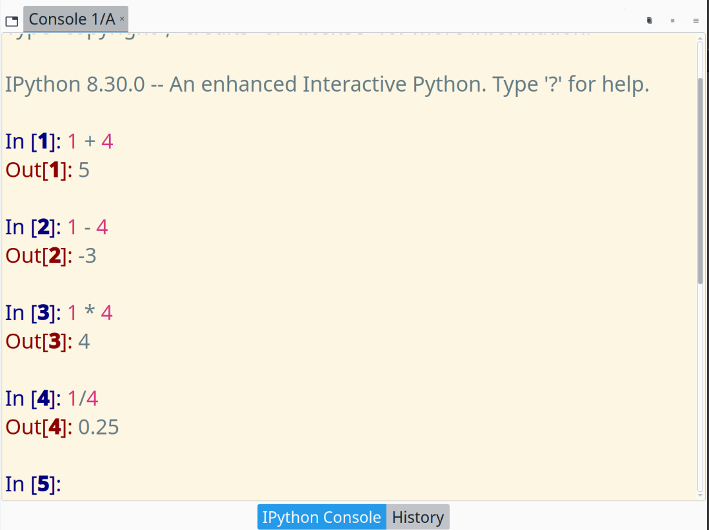
#+REVEAL_HTML: 

#+REVEAL_HTML: 

Variable definitions
#+ATTR_HTML: :width 700px
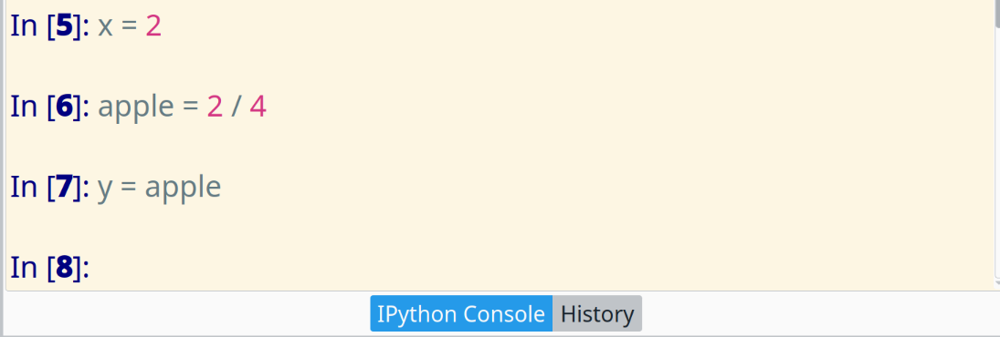

Check the *variable explorer*:

#+ATTR_HTML: :width 700px
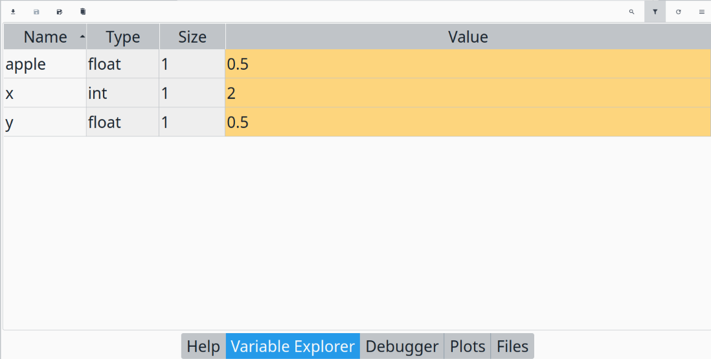
#+REVEAL_HTML: 

#+REVEAL: split
What is the value of ~y~ after execution of the prompts shown in the IPython terminal?
#+ATTR_HTML: :width 900px
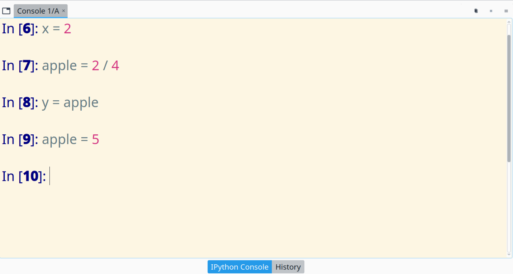

** Creating scripts for repeating tasks
Instead of writing code in the console, let's create a *script file* which contains the same code in the console.

#+REVEAL_HTML: 

+ Click on the ~File/New file~ button on the top menu bar to write a new script file
+ A new file similar to ~untitled0.py*~ will be opened. Notice that
  
  - ~untitled0.py~ is the script name
  - ~.py~ is the *file extension* which represents the file type
  - ~*~   appears when the file is not saved after any editing
#+ATTR_HTML: :width 900px
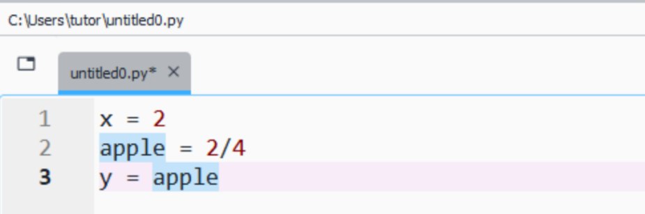
#+REVEAL_HTML: 

#+REVEAL_HTML: 

+ Click on the ~File/Save~ button to save it in a folder which is tracked by you
  
  - ~/c/Users/tutor/~ is the working folder
  - ~myscript.py~ is the saved script
#+ATTR_HTML: :width 900px
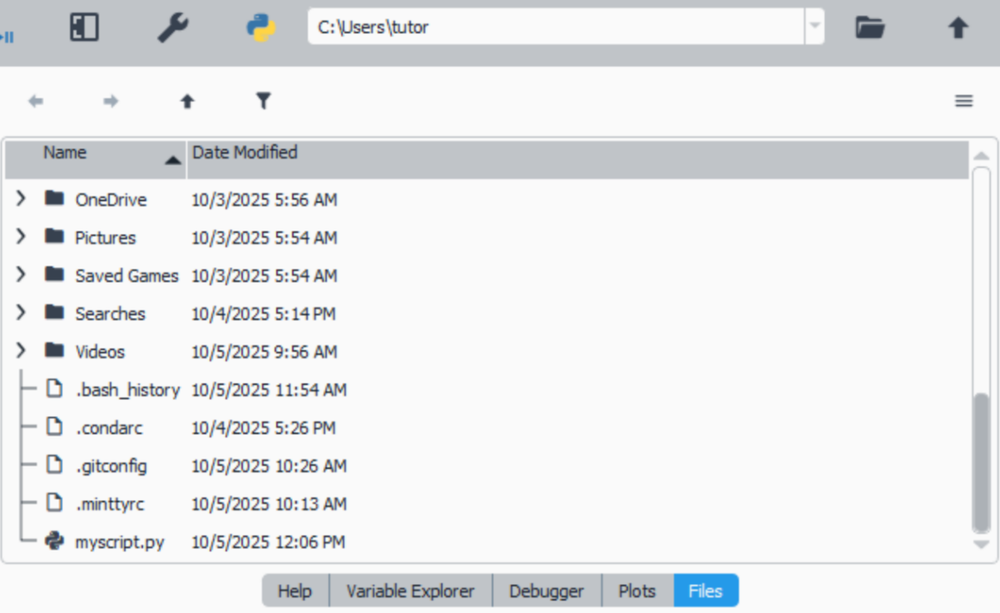
#+REVEAL_HTML: 

** Running the scripts
#+REVEAL_HTML: 

Press the play button or F5 key on the keyboard

#+ATTR_HTML: :width 550px
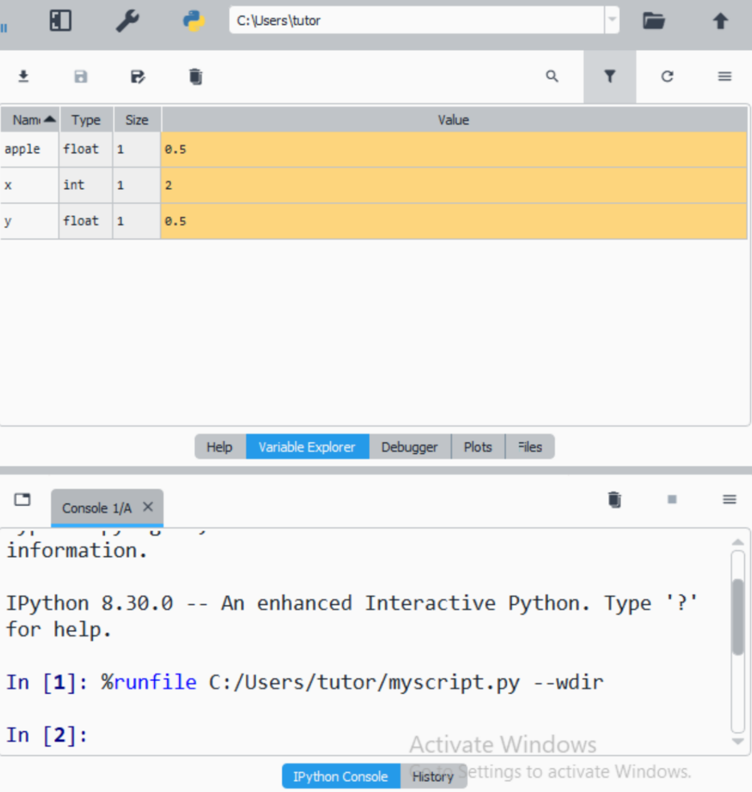

Check

+ the console if there is *errors*
+ the *variables* in the variable explorer
#+REVEAL_HTML: 

#+REVEAL_HTML: 

The variables can be accessed through the console

#+ATTR_HTML: :width 800px
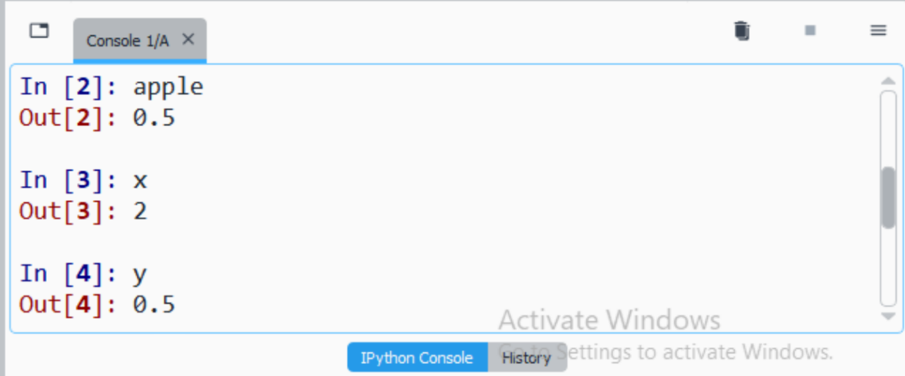
#+REVEAL_HTML: 

* Git-Bash Terminal
It is a terminal capable of running Bash commands, and other programs such as Git.
#+ATTR_HTML: :width 1200px
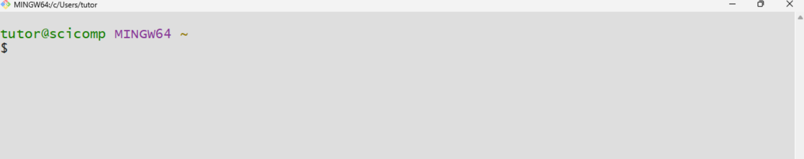

The common Bash commands used in tandem with Git program are
| ls    | (l)i(s)ts the contents of the current folder |
| cd    | (c)hanges (d)irectory/folder                 |
| pwd   | (p)rints (w)orking/current (d)irectory       |
| clear | (clear)s terminal window                     |

** First time configuring Git
After the installation and signing up in Github, we have to identify ourselves in Git system.

- write your Github login user name in ~" "~
- write your Github login email (student) in ~" "~  

This is done once.
#+ATTR_HTML: :width 1200px
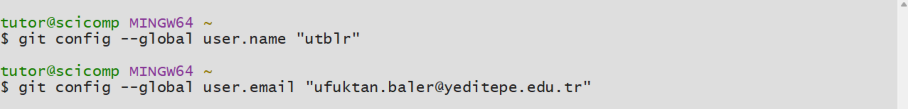

** A remote repository
A remote repository is some kind of a folder which generally holds the folders and files of a specific project.

A sample remote repository on Github is shown,
#+ATTR_HTML: :width 1000px
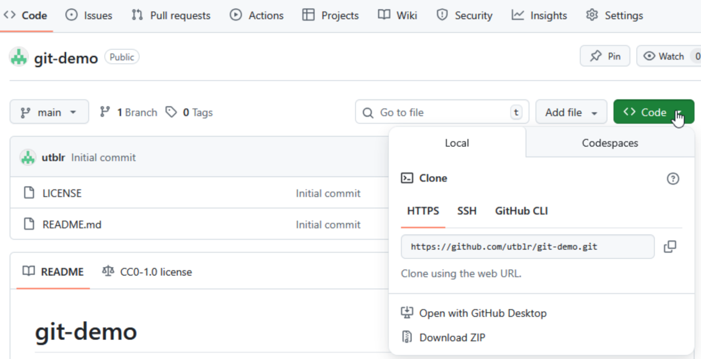

The address of the repository can be copied from the Code button.

** Cloning a repository
A remote repository can be cloned/downloaded (_for once_) to our local computer.

#+REVEAL_HTML: 

First, be aware of what is your current folder by issuing ~pwd~!!

#+ATTR_HTML: :width 400px
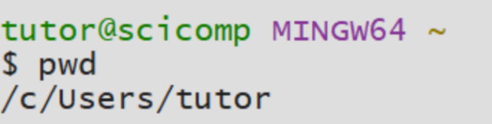
#+REVEAL_HTML: 

#+REVEAL_HTML: 

Then, ~git clone~ command is capable of clonning the repository as a folder to your current folder.
#+ATTR_HTML: :width 1000px
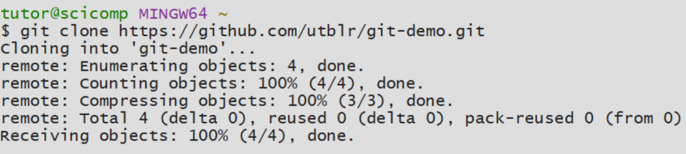
#+REVEAL_HTML: 

#+REVEAL: split

#+REVEAL_HTML: 

Check if the repository is downloaded by issuing ~ls~,
#+ATTR_HTML: :width 400px
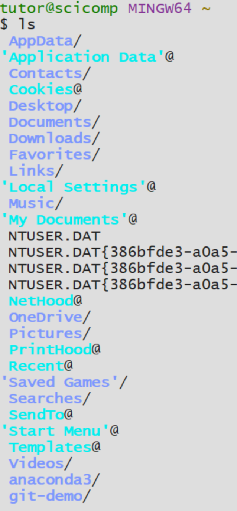
#+REVEAL_HTML: 

#+REVEAL_HTML: 

Then, go into the cloned repository by using ~cd~ command, and check the contents,

#+ATTR_HTML: :width 400px
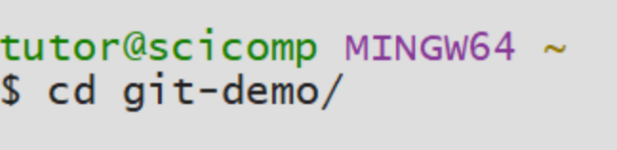

#+ATTR_HTML: :width 600px
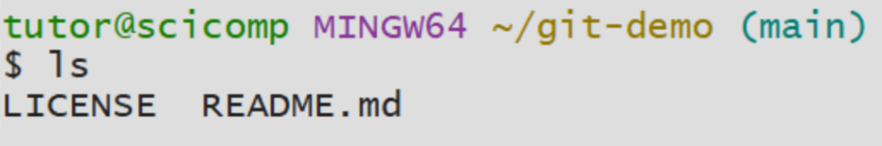

There is only two files which are as same as the ones in the remote repository!

#+REVEAL_HTML: 

** New code in the repo
In this section, we are going to create a new Python file and push the file to the remote repository.
The algorithm would be,
1. Open Spyder
2. Go to the repository folder in Spyder
3. Create a new file
4. Save the file
5. Stage the file with Git
5. Commit the file with Git
6. Push the file with Git
7. Check the remote repository
   
*** Open and go to the repository folder in Spyder
Assuming Spyder is opened, navigate through the folders using the Files section in the top right window,

#+ATTR_HTML: :width 1000px
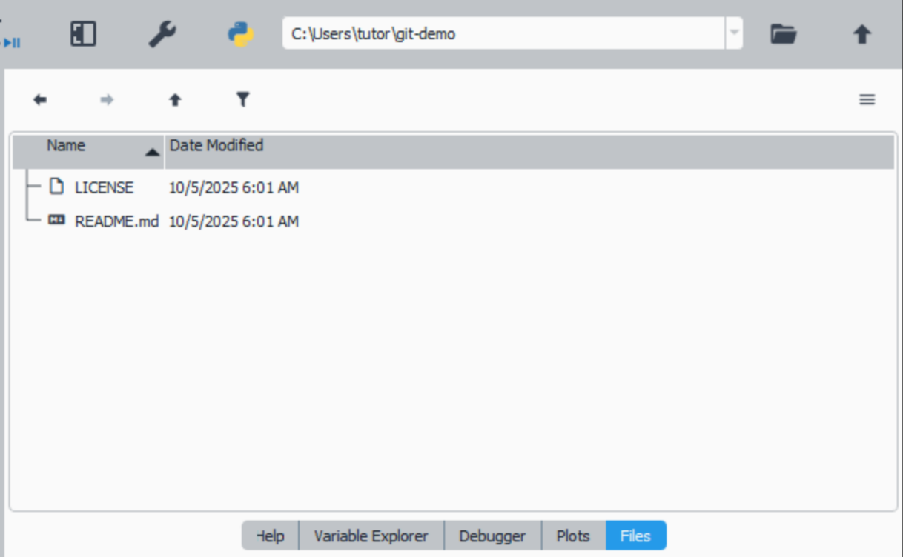

*** Create a new file
Let's create a new file,

#+ATTR_HTML: :width 270px
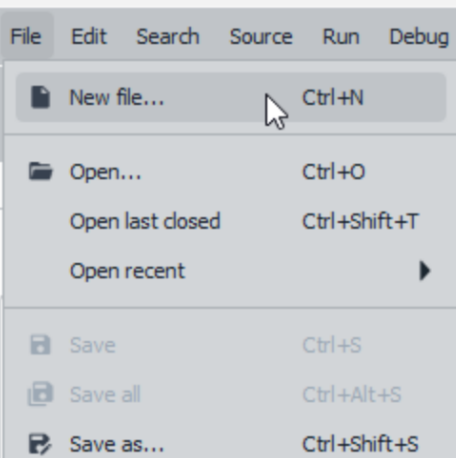

Let's write some code in the editor,

#+ATTR_HTML: :width 600px
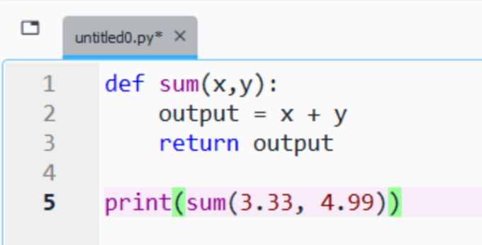

*** Save the file
Then save it under the repository folder,

#+ATTR_HTML: :width 270px
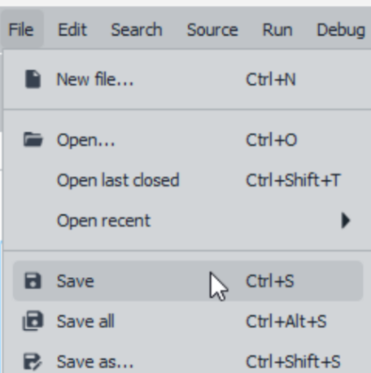

#+ATTR_HTML: :width 600px
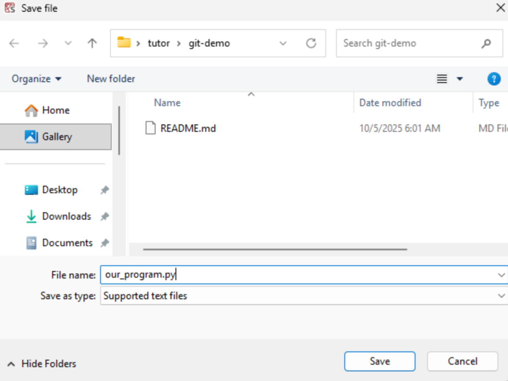

*** Stage the file with Git
First, check the saved file in the Git-Bash terminal,

#+ATTR_HTML: :width 600px
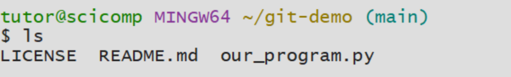

If it is there, then stage the file by issuing ~git add~

#+ATTR_HTML: :width 600px
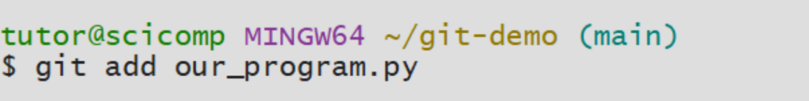

*** Commit the file with Git
Commit the staged file by issuing ~git commit -m~ with a comment at the end,

#+ATTR_HTML: :width 600px
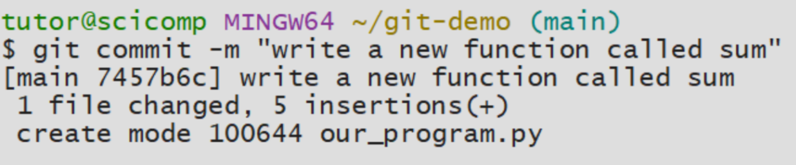

*** Push the file with Git
Having committed the file, now we can push the local repository to Github by issuing ~git push~,

#+ATTR_HTML: :width 500px
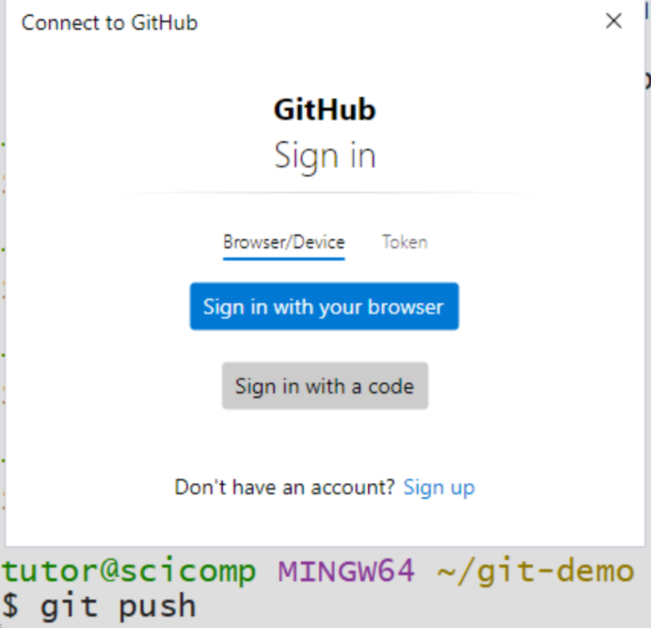

Notice that a pop-up window appeared, this is because of the first use of Git-Bash terminal. Press _Sign in with your browser_.

You should see something similar,
#+ATTR_HTML: :width 500px
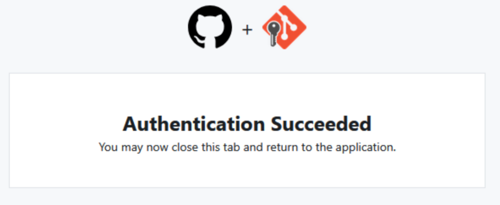

*** Check the remote repository
In Github we can see the recent pushed file,

#+ATTR_HTML: :width 1000px
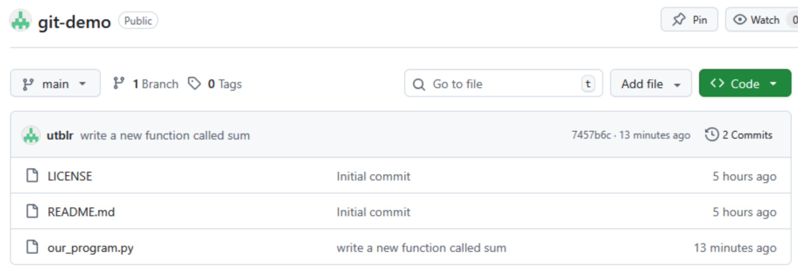
