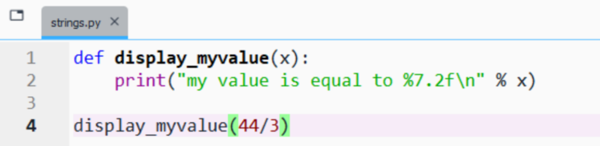
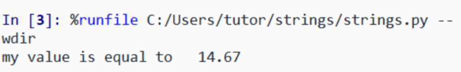
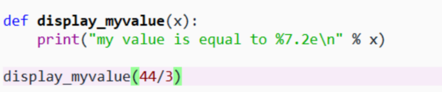
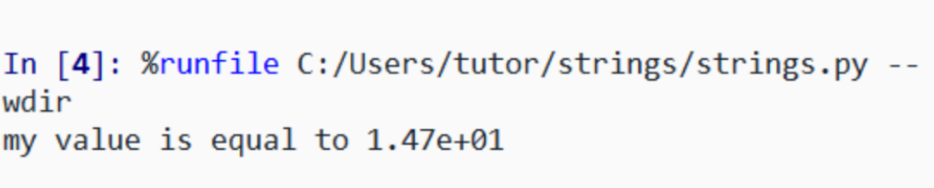
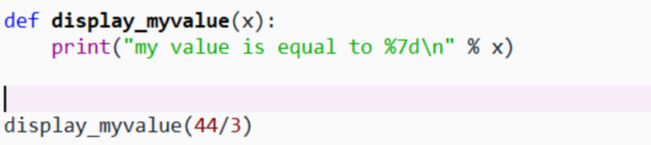
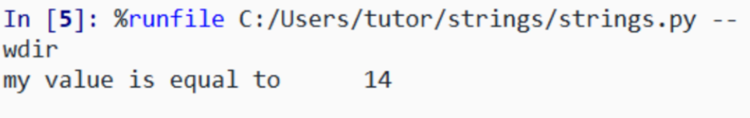
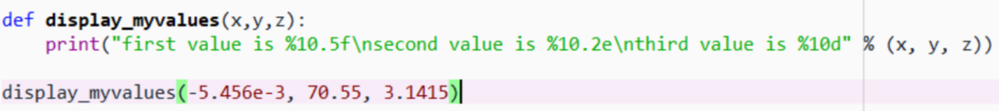
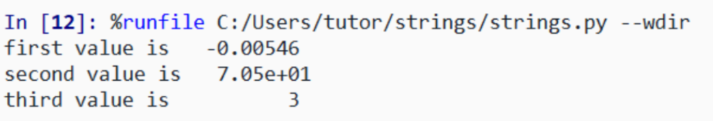
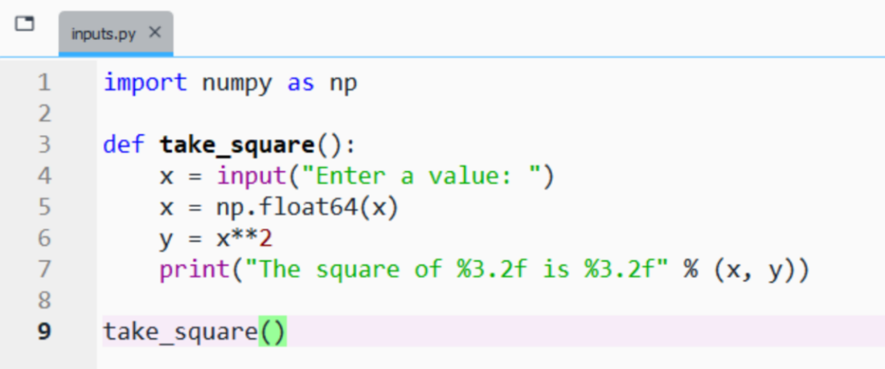
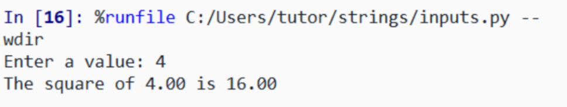

#+TITLE: ES118 Lecture #4
#+AUTHOR: Ufuk Baler, MSc. & Assoc. Prof. Dr. Fethi Okyar
#+SUBTITLE: Basic input and output, and defining functions
#+STARTUP: overview
#+REVEAL_THEME: simple
#+REVEAL_INIT_OPTIONS: slideNumber:"c/t", width:1920, height:1080, navigationMode:"linear", transition:"none"
#+REVEAL_TITLE_SLIDE: <h1>%t</h1> <h2>%s</h2> <h5>%a</h5>
#+OPTIONS: timestamp:nil toc:1 num:nil reveal_global_footer:nil
#+REVEAL_EXTRA_CSS: ../style.css
#+LATEX_HEADER: \usepackage{amsmath}
#+MACRO: color @@html:$2@@

* Formatted output
- Strings are sequence of characters: {{{color(green,"this is a string of characters")}}}
- We can put different variables in strings by *formatting*
- Numerical values can be used inside a string with its format *specified*

#+REVEAL: split

#+ATTR_HTML: :width 800px

#+ATTR_HTML: :width 800px

Let's break it down:
- {{{color(green,%)}}}: the specifier (first one)
- {{{color(green,7)}}}: the *minimum* width of the numerical output
- {{{color(green,2)}}}: the number of the fractional digits
- {{{color(green,.)}}}: separates the whole and the fractional digits
- {{{color(green,f)}}}: the floating-point notation
- {{{color(green,\n)}}}: the newline character
- {{{color(green,%)}}}: the separator (second one)
- {{{color(green,x)}}}: the substituted variable

#+REVEAL: split

Let's edit ~display_myvalue~ function:

#+ATTR_HTML: :width 800px

#+ATTR_HTML: :width 800px

Can you notice the difference from the previous definition?

#+REVEAL: split

Let's again edit ~display_myvalue~ function:

#+ATTR_HTML: :width 800px

#+ATTR_HTML: :width 800px

Can you notice the difference from the previous definitions?

#+REVEAL: split

As a summary the formats are,
| notation       | format |
|----------------+--------|
| floating-point | f      |
| scientific     | e      |
| integer        | d      |

#+REVEAL: split

Multiple values can be printed:
  
#+ATTR_HTML: :width 1600px

#+ATTR_HTML: :width 1000px

* User input from the console
- The user can input from the console
- ~input~ function is utilized
- A message is given as the argument of ~input~

#+REVEAL: split

#+ATTR_HTML: :width 1000px

#+ATTR_HTML: :width 1000px

* Remarks on functions
We've seen defining functions in assignments, and their use.

Let's summarize and make some remarks.

#+REVEAL: split

There can be four types of function definitions:

#+BEGIN_SRC python
  def myfunction(parameters):
      function-block
      return variables
#+END_SRC

#+BEGIN_SRC python
  def myfunction(parameters):
      function-block
#+END_SRC

#+BEGIN_SRC python
def myfunction():
    function-block
    return variables
#+END_SRC

#+BEGIN_SRC python
def myfunction():
    function-block
#+END_SRC

#+REVEAL: split

- a script may have several functions
- a function can be called in another function
- contents of the function are established by indentation
    
