#+TITLE: ES118 Lecture #5
#+AUTHOR: Ufuk Baler, MSc. & Assoc. Prof. Dr. Fethi Okyar
#+SUBTITLE: Logical operators, conditionals and loops
#+STARTUP: overview
#+REVEAL_THEME: simple
#+REVEAL_INIT_OPTIONS: slideNumber:"c/t", width:1920, height:1080, navigationMode:"linear", transition:"none"
#+REVEAL_TITLE_SLIDE: <h1>%t</h1> <h2>%s</h2> <h5>%a</h5>
#+OPTIONS: timestamp:nil toc:1 num:nil reveal_global_footer:nil
#+REVEAL_EXTRA_CSS: ../style.css
#+LATEX_HEADER: \usepackage{amsmath}
#+MACRO: color @@html:$2@@

* Loops and conditional use cases
- transient problems (time involved)
  + heat transfer: $T$ temperature
  + diffusion materials: $\rho$ density
  + dynamics of mechanical systems: $\vec{F}$ forces, $\vec{u}$ positions
  + molecular dynamics: $\vec{u}$ molecular positions
- finding roots of a function
  + bisection method
  + Newton-Raphson method

- https://www.youtube.com/watch?v=RYUr-5PYA7s
- https://www.youtube.com/watch?v=W2_21xculPM
- https://www.youtube.com/watch?v=Gl9ZV8wCZtY        
- https://www.youtube.com/shorts/LpHrso7mzhc
- https://www.youtube.com/watch?v=hKnO7dqkLjA  

* ~if~ conditional
The ~if~ conditional is a statement that evaluates a code block *when the given condition is satisfied*.

#+BEGIN_SRC python
if CONDITION:
    CODE-BLOCK
#+END_SRC
* ~else~ conditional
When the CONDITION is *not* satisfied in ~if~, then the code block written under ~else~ statement is evaluated,

#+BEGIN_SRC python
if CONDITION:
    CODE-BLOCK-1
else:
    CODE-BLOCK-2
#+END_SRC

* ~elif~ conditional
~elif~ comes from *(el)se (if)*

The code under the ~elif~ statement is evaluated when the previous conditionals fail, and accepts a condition different from ~else~.
#+REVEAL_HTML: 

#+BEGIN_SRC python
if CONDITION-1:
    CODE-BLOCK-1
elif CONDITION-2:
    CODE-BLOCK-2
elif CONDITION-3:
    CODE-BLOCK-3
.
.
.
#+END_SRC
#+REVEAL_HTML: 

#+REVEAL_HTML: 

#+BEGIN_SRC python
if CONDITION-1:
    CODE-BLOCK-1
elif CONDITION-2:
    CODE-BLOCK-2
.
.
.
else:
    CODE-BLOCK-N
#+END_SRC
#+REVEAL_HTML: 

* Comparative operators
We can compare two variables using the operators below,
| Name                         | Operator |
|------------------------------+----------|
| is *greater* than            | ~>~      |
| is *less* than               | ~<~      |
| is *greater* than or *equal* | ~>=~     |
| is *less* than or *equal*    | ~<=~     |
| is *equal*                   | ~==~     |
| is *not equal*               | ~!=~     |

Result of the comparative operators is a *boolean value*: ~True~, ~False~

Therefore, we can utilize them in ~if~ conditionals.

#+REVEAL: split

#+ATTR_HTML: :width 1300px
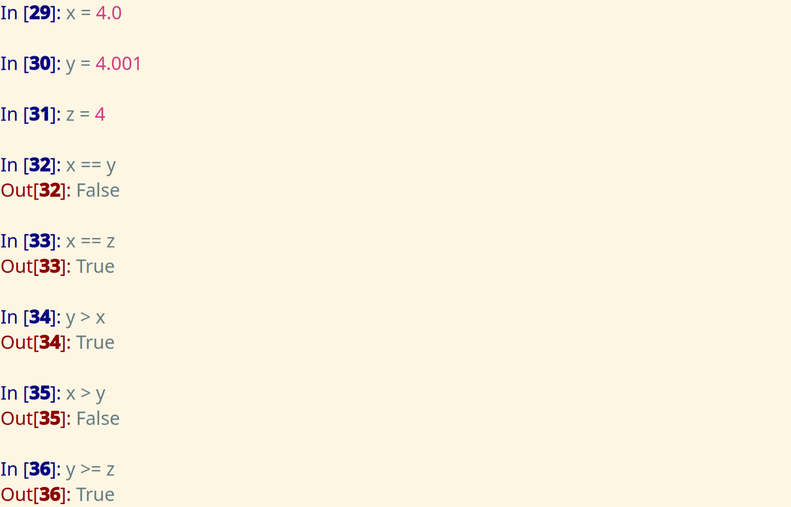

* Basic logical operators
Logical operators are as follows
- AND: ~and~
- OR: ~or~
- NOT: ~not~

Result of the logical operators is a *boolean value*: ~True~, ~False~

Therefore, we can also utilize them in ~if~ conditionals.

#+ATTR_HTML: :width 800px
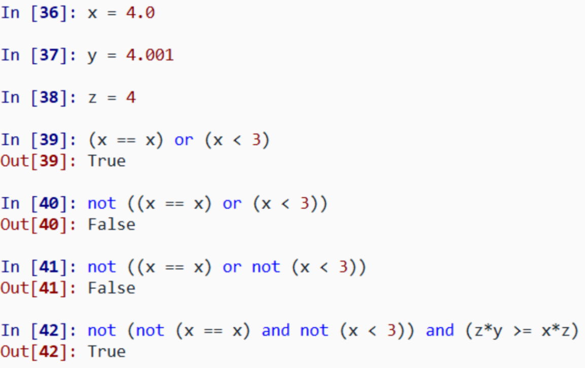

* Speed ticket example

#+REVEAL_HTML: 

#+ATTR_HTML: :width 500px
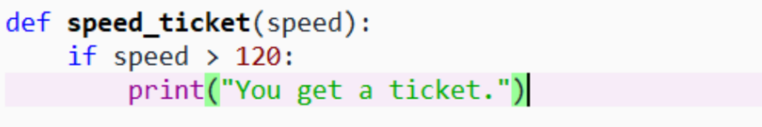
#+ATTR_HTML: :width 500px
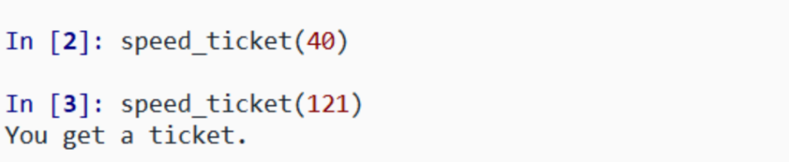

#+REVEAL_HTML: 

#+REVEAL_HTML: 

#+ATTR_HTML: :width 500px
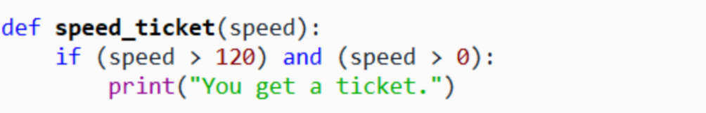
#+ATTR_HTML: :width 500px
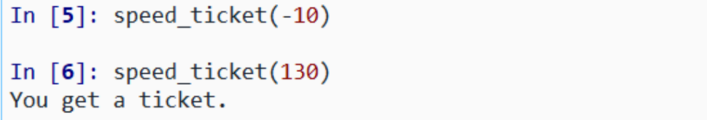

#+REVEAL_HTML: 

#+REVEAL_HTML: 

#+ATTR_HTML: :width 500px
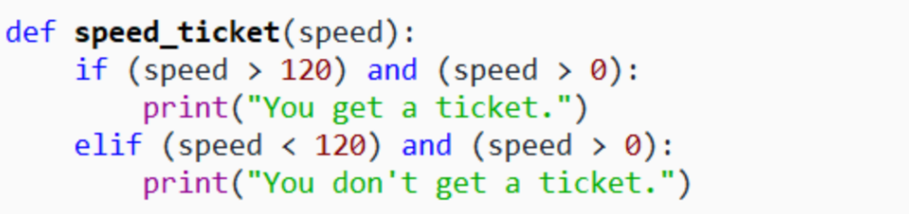
#+ATTR_HTML: :width 500px
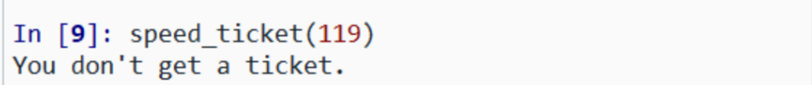

#+REVEAL_HTML: 

* Water state example
#+ATTR_HTML: :width 900px
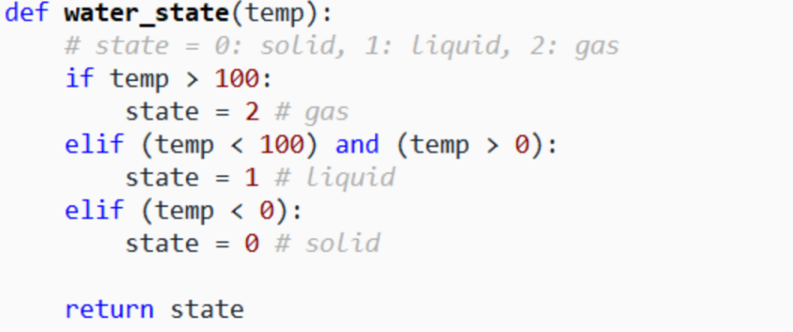
#+ATTR_HTML: :width 600px
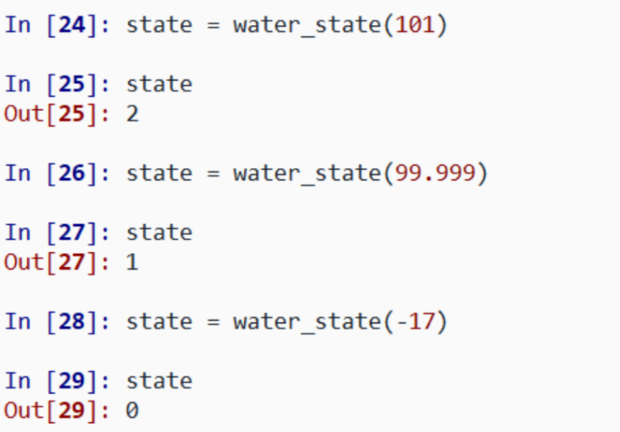

* The sign of a number example
#+ATTR_HTML: :width 900px
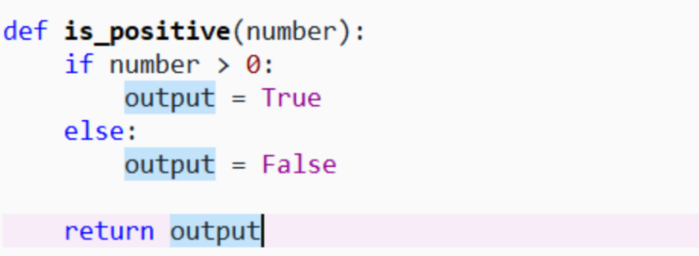
#+ATTR_HTML: :width 600px
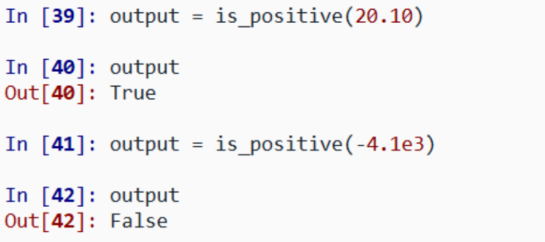

* "~for~" loop
A ~for~ loop *repeats* some code.

#+BEGIN_SRC python
for index in sequence:
  repeated code here
#+END_SRC

- ~index~: the iteration variable that respectively *holds* a value in the ~sequence~
- ~sequence~: an *iterable* object, e.g. a ~range~, a list, a tuple

* Temperature conversion example
#+ATTR_HTML: :width 800px
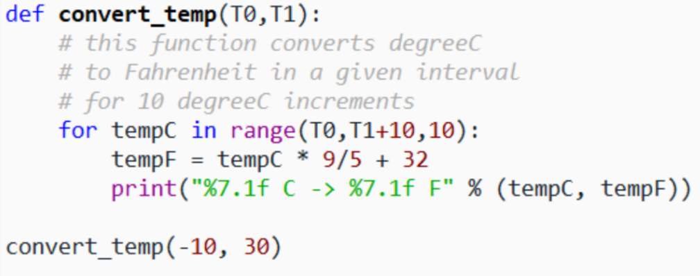
#+ATTR_HTML: :width 800px
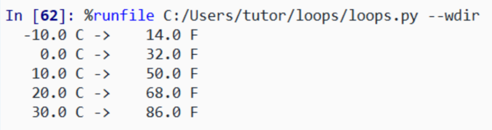

* Depth calculation example
#+ATTR_HTML: :width 800px
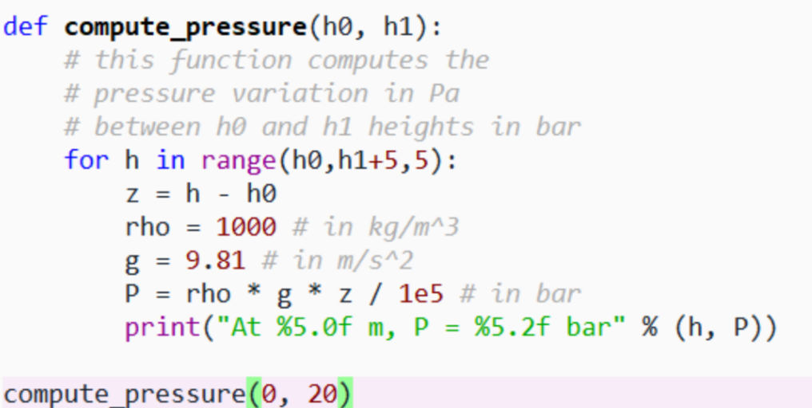
#+ATTR_HTML: :width 800px
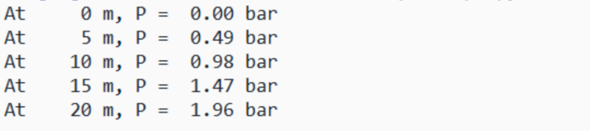

* Nesting for loops
#+BEGIN_SRC python
for index-1 in sequence-1:
  repeated code here
  for index-2 in sequence-2:
    repeated code here
#+END_SRC

#+ATTR_HTML: :width 800px
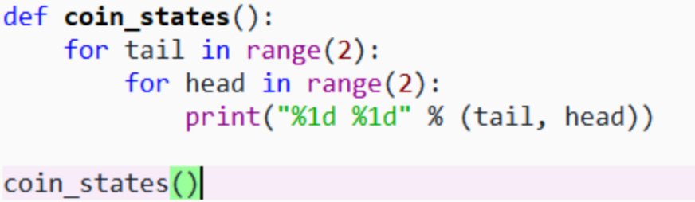
#+ATTR_HTML: :width 800px
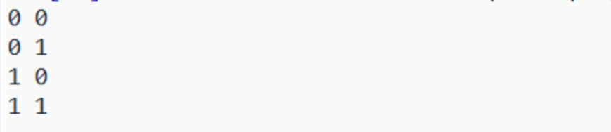

* "~while~" loop
A *~while~* loop repeats some code as long as the given condition is *satisfied*.

#+BEGIN_SRC python
while condition:
  repeated code here
#+END_SRC

* Free-fall example
#+REVEAL_HTML: 

#+ATTR_HTML: :width 950px
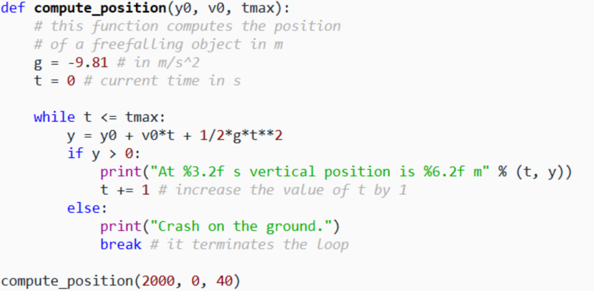
#+REVEAL_HTML: 

#+REVEAL_HTML: 

#+ATTR_HTML: :width 550px
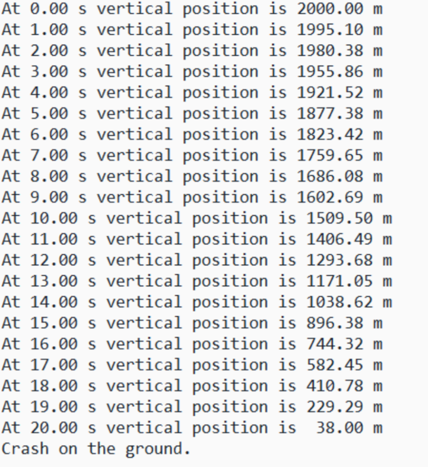
#+REVEAL_HTML: 

* Some remarks on loops
- we can create nested loops
- ~break~ used for terminating a "for" or a "while" loop
- ~continue~ used for jumping an iteration of a "for" or a "while" loop

