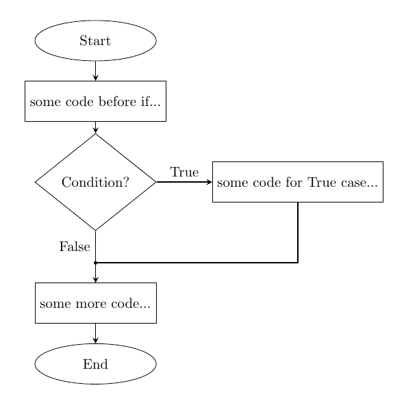
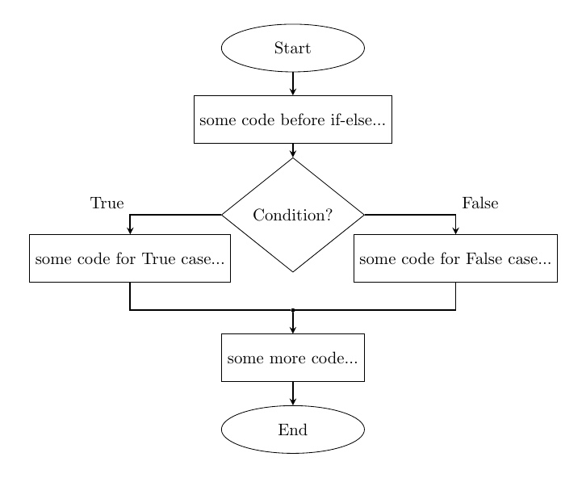
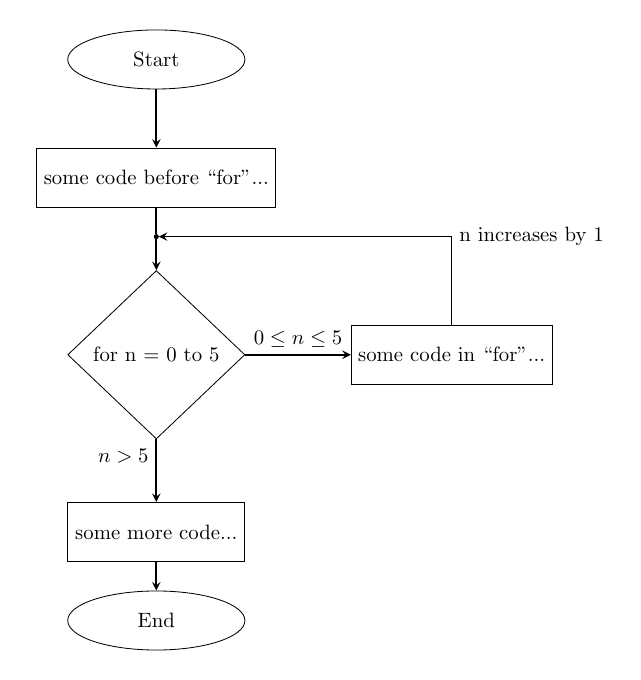
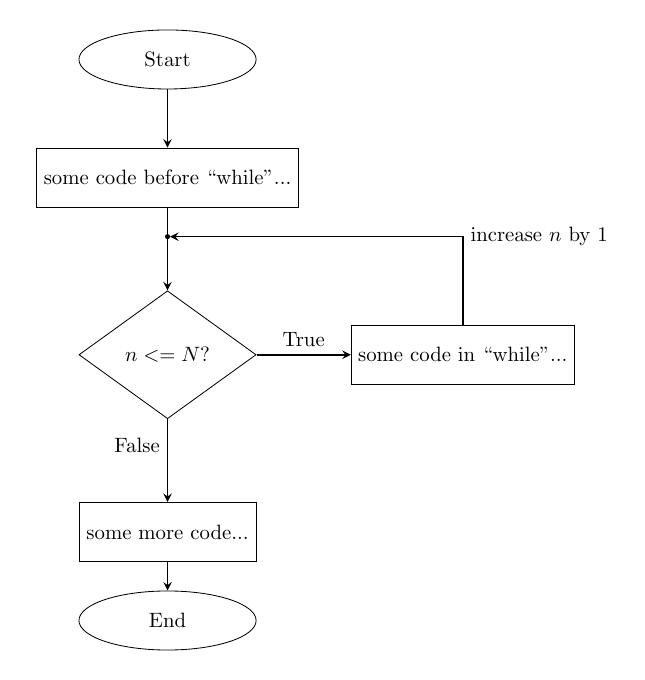
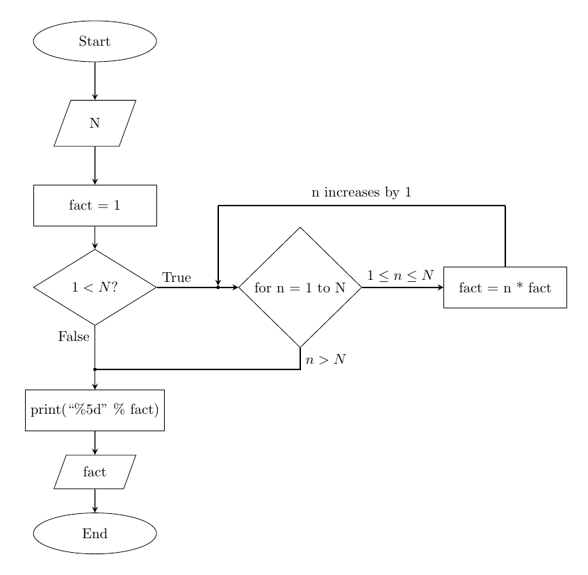
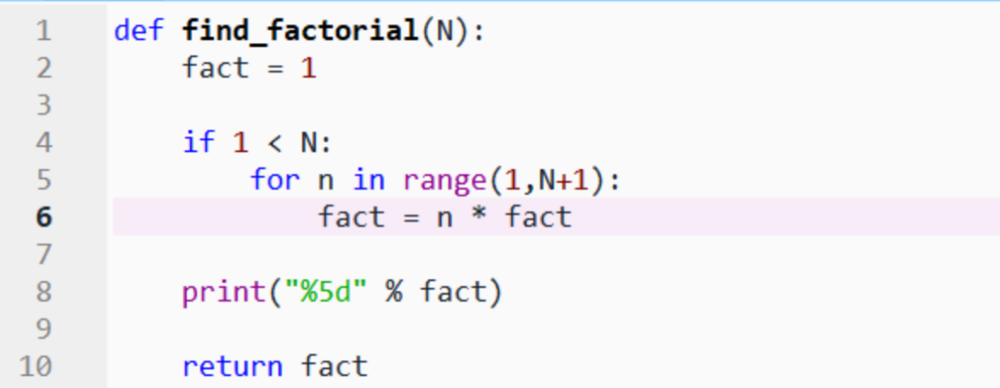
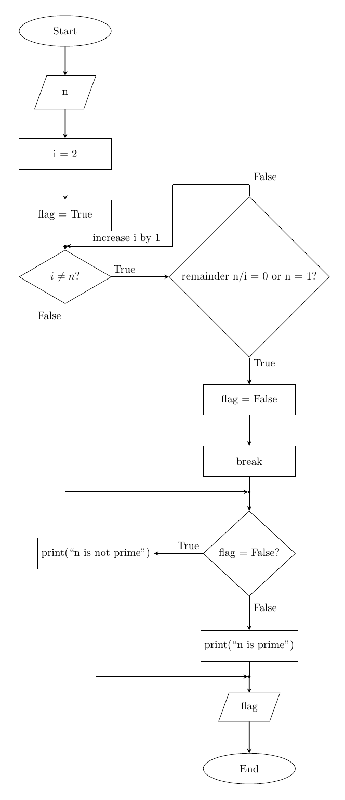
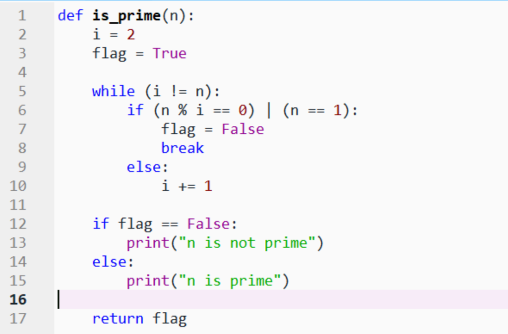

#+TITLE: ES118 Lecture #6
#+AUTHOR: Ufuk Baler, MSc. & Assoc. Prof. Dr. Fethi Okyar
#+SUBTITLE: Algorithm representations
#+STARTUP: overview
#+REVEAL_THEME: simple
#+REVEAL_INIT_OPTIONS: slideNumber:"c/t", width:1920, height:1080, navigationMode:"linear", transition:"none"
#+REVEAL_TITLE_SLIDE: <h1>%t</h1> <h2>%s</h2> <h5>%a</h5>
#+OPTIONS: timestamp:nil toc:1 num:nil reveal_global_footer:nil
#+REVEAL_EXTRA_CSS: ../style.css
#+LATEX_HEADER: \usepackage{amsmath}
#+MACRO: color @@html:$2@@

* Algorithm representations
An algorithm can be represented with two methods
- flowcharts
- pseudocodes  

* if
#+ATTR_HTML: :width 800px

* if-else
#+ATTR_HTML: :width 800px

* for
#+ATTR_HTML: :width 800px

https://problemsolvingwithpython.com/09-Loops/09.04-Flowcharts-Describing-Loops/

* while
#+ATTR_HTML: :width 800px

* factorial example
#+REVEAL_HTML: 

#+ATTR_HTML: :width 800px

#+REVEAL_HTML: 

#+REVEAL_HTML: 

#+ATTR_HTML: :width 800px

#+REVEAL_HTML: 

* prime example
#+REVEAL_HTML: 

#+ATTR_HTML: :width 400px

#+REVEAL_HTML: 

#+REVEAL_HTML: 

#+ATTR_HTML: :width 600px

#+REVEAL_HTML: 

* Pseudocodes
Check the below resources:

https://student.cs.uwaterloo.ca/~cs231/resources/pseudocode.pdf

https://pseudocode.deepjain.com/guides/if/

https://pseudocode.deepjain.com/guides/loops/

https://pseudocode.deepjain.com/guides/io/

