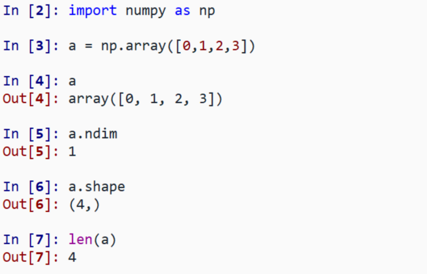
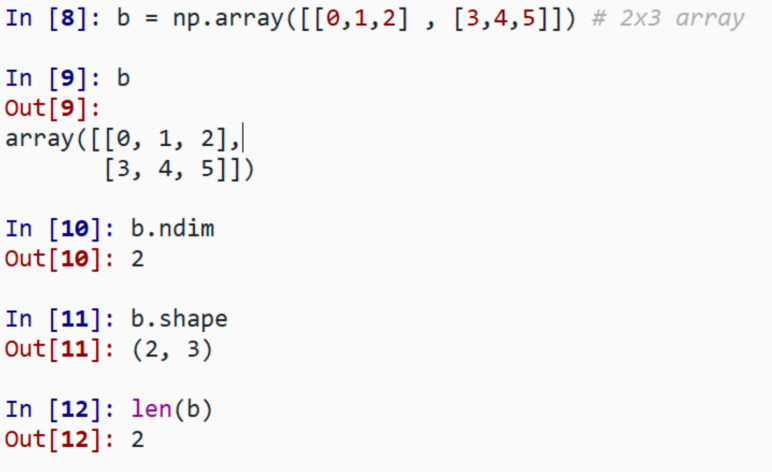
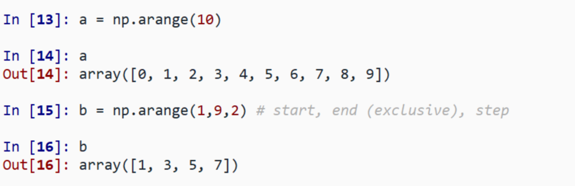
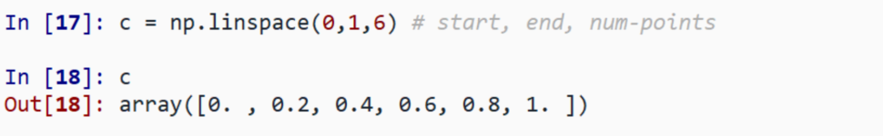
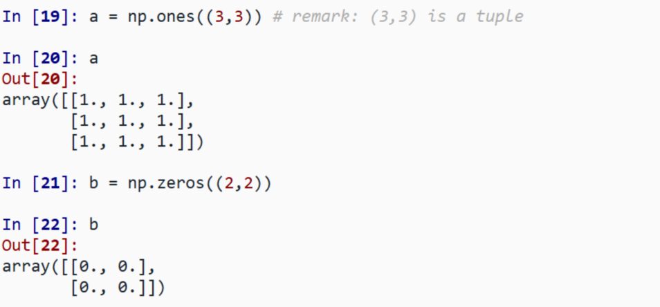
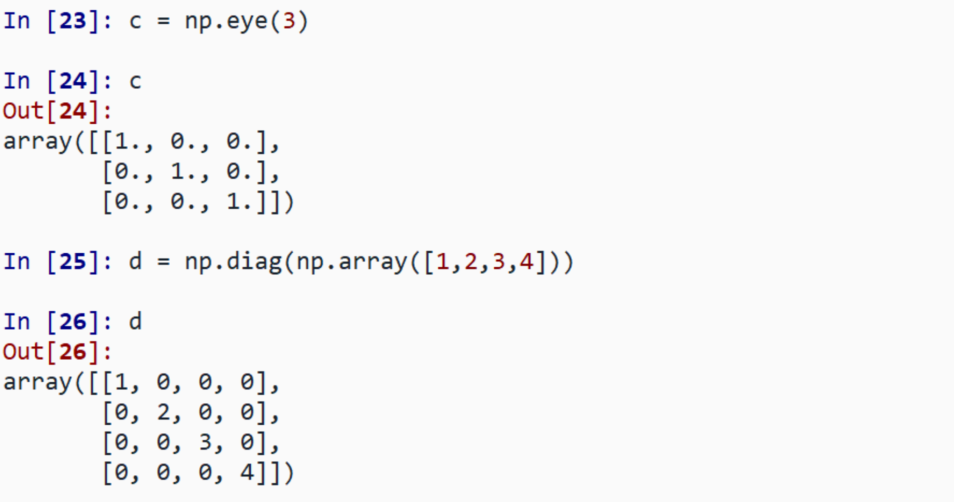
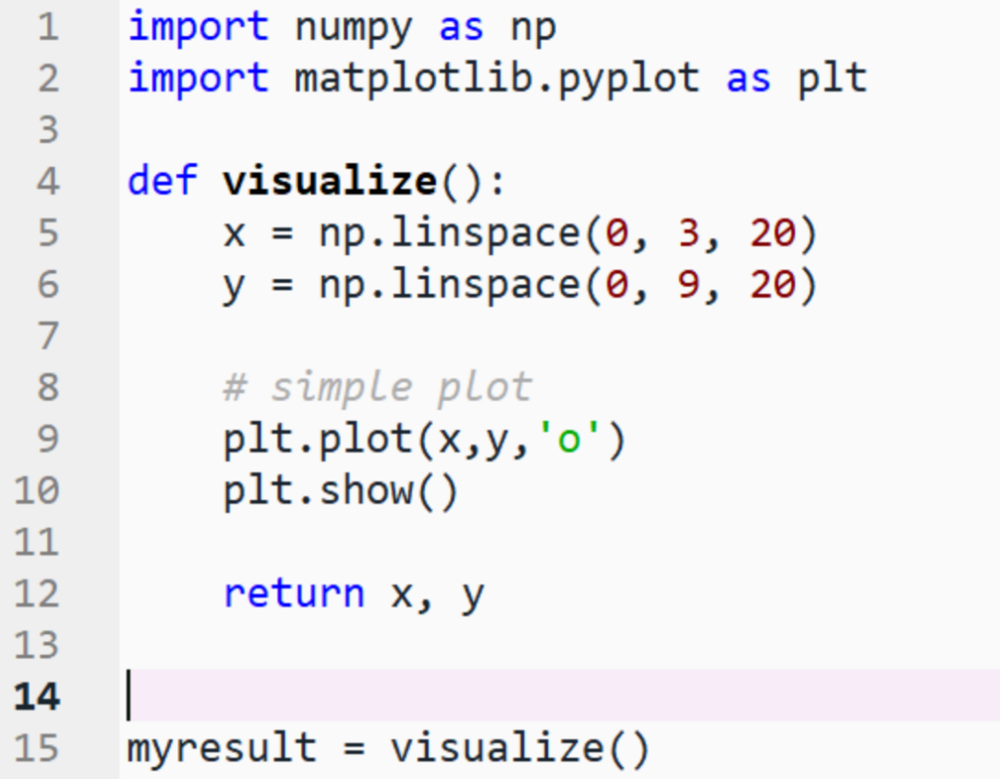
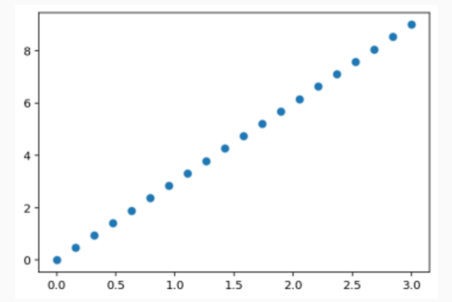

#+TITLE: ES118 Lecture #7
#+AUTHOR: Ufuk Baler, MSc. & Assoc. Prof. Dr. Fethi Okyar
#+SUBTITLE: Array definitions
#+STARTUP: overview
#+REVEAL_THEME: simple
#+REVEAL_INIT_OPTIONS: slideNumber:"c/t", width:1920, height:1080, navigationMode:"linear", transition:"none"
#+REVEAL_TITLE_SLIDE: <h1>%t</h1> <h2>%s</h2> <h5>%a</h5>
#+OPTIONS: timestamp:nil toc:1 num:nil reveal_global_footer:nil
#+REVEAL_EXTRA_CSS: ../style.css
#+LATEX_HEADER: \usepackage{amsmath}
#+MACRO: color @@html:$2@@

* Use examples of arrays
- values of an experiment/simulation at discrete time step
- X-Y-Z positions of an object
- pixels of an image
- ...  

* Difference of lists and NumPy arrays
#+REVEAL_HTML: 

*Python lists*
#+BEGIN_SRC python
my_list = [0,1,2,3]
#+END_SRC
#+REVEAL_HTML: 

#+REVEAL_HTML: 

*NumPy arrays*
#+BEGIN_SRC python
my_numpy_array = np.array([0,1,2,3])
#+END_SRC
#+REVEAL_HTML: 

Why NumPy?:
- easy interface to operate on large amounts of data
- memory-efficient container that provides fast numerical operations

* Creating arrays
** Manual construction of arrays
#+REVEAL_HTML: 

*1-D*:
#+ATTR_HTML: :width 800px

#+REVEAL_HTML: 

#+REVEAL_HTML: 

*2-D*:
#+ATTR_HTML: :width 800px

#+REVEAL_HTML: 

#+REVEAL_HTML: 

*Exercise: Simple arrays*
- Create a simple two dimensional array. First, redo the examples from above. And then create
your own: how about odd numbers counting backwards on the first row, and even numbers on
the second?
- Use the functions ~len()~, ~np.shape()~ on these arrays. How do they relate to each other?
And to the ndim attribute of the arrays?
#+REVEAL_HTML: 

* Functions for creating arrays
In practice, we rarely enter items one by one.
** evenly spaced
*arange*:
#+ATTR_HTML: :width 800px

*linspace*:
#+ATTR_HTML: :width 800px

** common arrays
#+REVEAL_HTML: 

*ones & zeros*:
#+ATTR_HTML: :width 800px

#+REVEAL_HTML: 

#+REVEAL_HTML: 

*eye & diag*:
#+ATTR_HTML: :width 800px

#+REVEAL_HTML: 

#+REVEAL_HTML: 

*Exercise: Creating arrays using functions*

Experiment with ~arange~, ~linspace~, ~ones~, ~zeros~, ~eye~ and ~diag~.
#+REVEAL_HTML: 

* Basic visualization
Let's create a function called ~visualize~ which will use two arrays ~x~ and ~y~ to create a basic plot:

#+REVEAL_HTML: 

#+ATTR_HTML: :width 800px

#+REVEAL_HTML: 

#+REVEAL_HTML: 

#+ATTR_HTML: :width 800px

#+REVEAL_HTML: 

#+REVEAL: split

#+REVEAL_HTML: 

*Exercise: Simple visualizations*

Plot some simple arrays: a cosine as a function.
#+REVEAL_HTML: 

