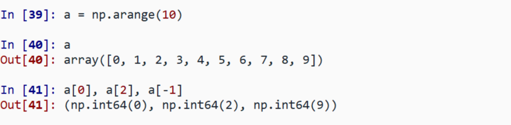
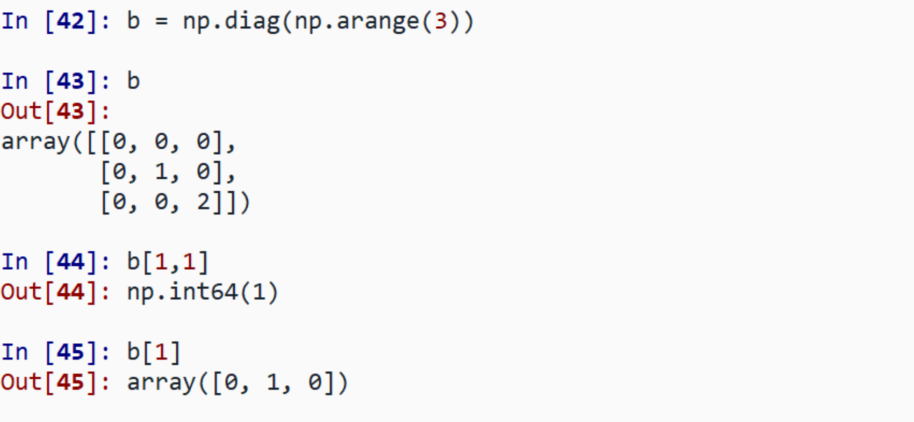
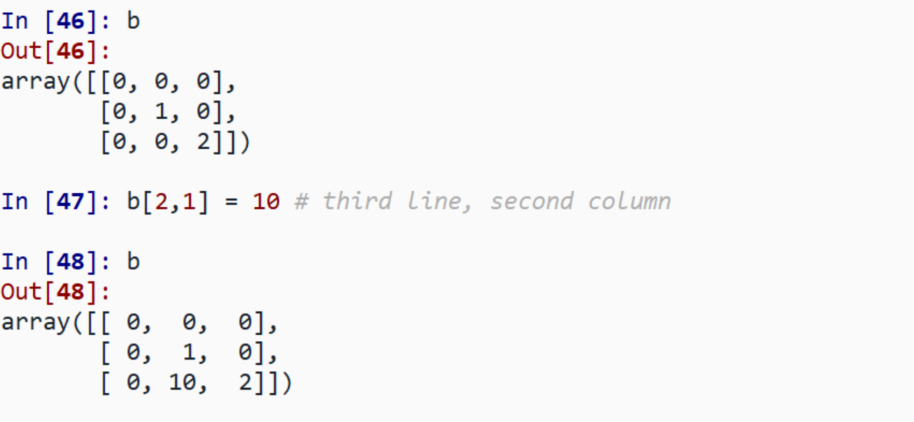
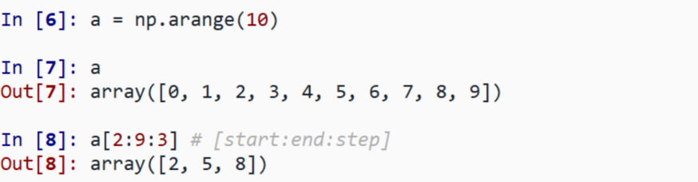
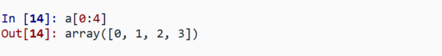
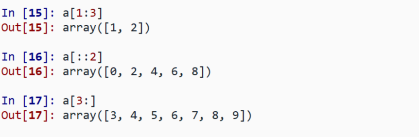
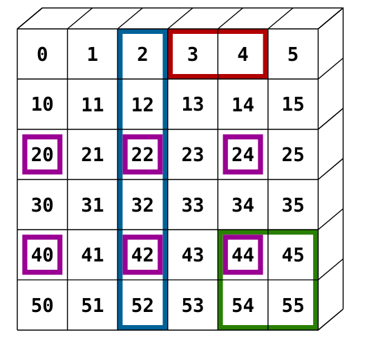

#+TITLE: ES118 Lecture #8
#+AUTHOR: Ufuk Baler, MSc. & Assoc. Prof. Dr. Fethi Okyar
#+SUBTITLE: Indexing arrays
#+STARTUP: overview
#+REVEAL_THEME: simple
#+REVEAL_INIT_OPTIONS: slideNumber:"c/t", width:1920, height:1080, navigationMode:"linear", transition:"none"
#+REVEAL_TITLE_SLIDE: <h1>%t</h1> <h2>%s</h2> <h5>%a</h5>
#+OPTIONS: timestamp:nil toc:1 num:nil reveal_global_footer:nil
#+REVEAL_EXTRA_CSS: ../style.css
#+LATEX_HEADER: \usepackage{amsmath}
#+MACRO: color @@html:$2@@

* Indexing
The items of a NumPy array can be accessed

#+REVEAL_HTML: 

*1-D*:

#+ATTR_HTML: :width 800px

#+REVEAL_HTML: 

#+REVEAL_HTML: 

*2-D*:

#+ATTR_HTML: :width 800px

#+REVEAL_HTML: 

#+REVEAL_HTML: 

*Note*: In 2-D, the first dimension corresponds to *rows*, the second to *columns*
#+REVEAL_HTML: 

#+REVEAL: split
The items of a NumPy array can be assigned to a new value

#+ATTR_HTML: :width 800px

* Slicing
Slicing is accessing a range of values of an array:
#+ATTR_HTML: :width 800px

Last index is not included:
#+ATTR_HTML: :width 800px

All three slice components are not required, by default:
~[start:end:step]~ $\rightarrow$ ~[0:-1:1]~

#+ATTR_HTML: :width 800px

#+REVEAL: split
*Exercise: Slicing a 2-D array*

Define the array, then slice the depicted regions
#+ATTR_HTML: :width 800px

#+REVEAL: split
We will continue next week.
